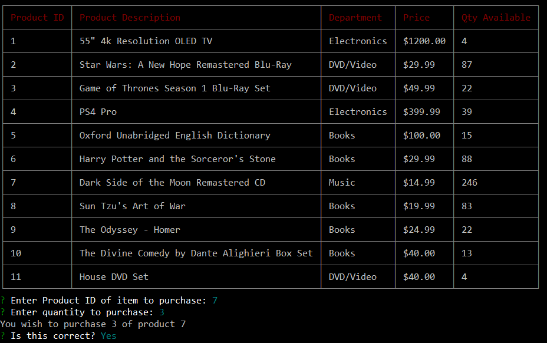
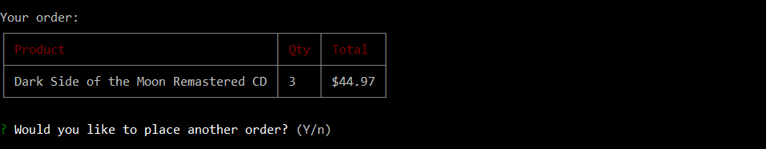

# Retail-App-CLI
A CLI-based app that simulates an online retail environment

## Customer View

Run Path: `node bamazonCustomer.js`

The Customer view allows a customer to place orders for any of the items offered for sale.

Upon starting the application, the customer will be shown a table listing all available products, and including description, department, price, and availability info for each product, as well as a unique ID to identify the product.

Customers are then prompted to enter the ID corresponding to the item that they wish to purchase. Once an ID has been entered, they will then enter the quantity that they wish to purchase. IDs will be checked to make sure they are valid and quantites must be 1 or greater.

Once the application determines a valid order has been placed, the order request is sent to the database. The available quantity is checked to make sure there are enough of the selected item to fulfill the order. If there is sufficient quantity, the order is placed and that many units are deducted from the stock in the database. The customer is informed of their order, including the total cost for the quantity they ordered.

The customer is then asked if they would like to make another purchase. If they would like to do so, the application starts over at the list of items for purchase and continues from there. If the customer opts not to place another order, the application terminates.

## Manager View

Run Path: `node bamazonManager.js`

The Manager view allows a manager to view products, get reports on low inventory, add additional stock to existing products, and add new products for sale.

Upon starting the application, the manager will be prompted to choose which operation they wish to perform, or to exit the program.

### View Products for Sale

Queries the database and displays a table showing all products available. Shows Product IDs, description, department, price per item, and available quantity for sale.

### View Low Inventory

Queries the database for items with low stock (less than 5 quantity available). Shows Product ID, description, department, and remaining quantity.

### Add to Inventory

Allows the manager to add additional quantity to items. The manager is prompted to enter a Product ID and a quantity to add. The database is queried and updates the matching item with the additional stock.

### Add New Product

Asks the manager to enter product information for a new product. The manager is prompted to enter a short product description, department, price, and initial quantity for the new product. The information is then sent to the database, where the new product is entered as automatically assigned a Product ID.

